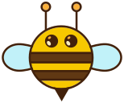

# Bee
  
*[Logo vector created by Freepik](http://www.freepik.com/free-photos-vectors/logo)*

:honeybee: Bee :honeybee: project is DSL library which allow to create views from :honeybee: scripts.
Bee should be as much cross platform as much possible.

Goals:  
- simplicity
- easy use
- extendability

We create beehive and add there our bees.
Files extension should be `*.bee`

`*.bee` contains view description.

## Dependencies
- [Selene](https://github.com/jeremyong/Selene) as submodule for lua bindings
- Pick integration or create own
- LUA Engine working with your integration
- Jar for honey :honey_pot:

https://en.wikipedia.org/wiki/Beekeeping

Words
- hive
- beehive
- beekeeper
- honey
- beeswax
- royal jelly
- apiary
